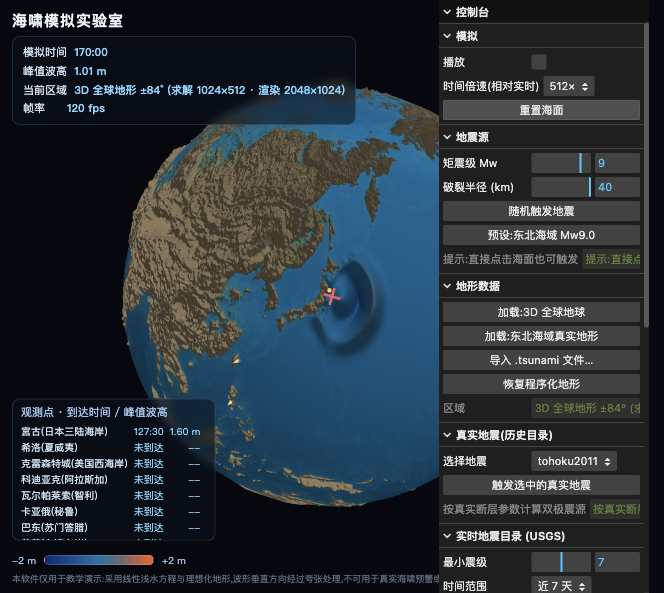
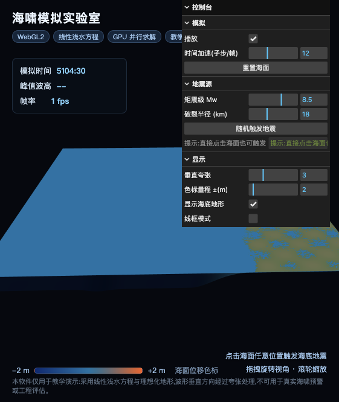
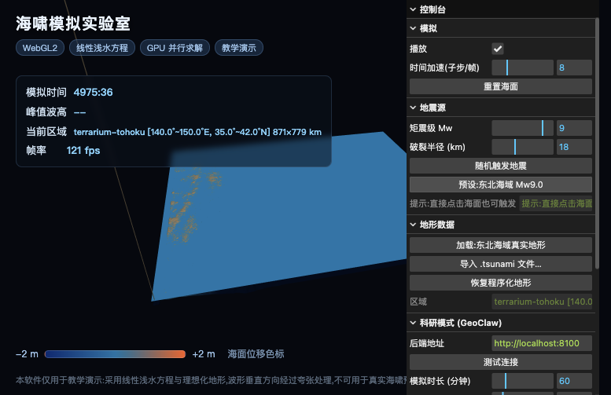
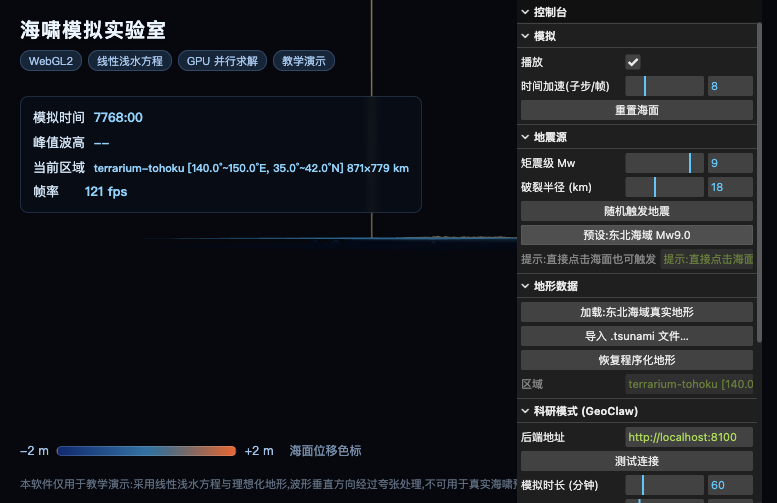
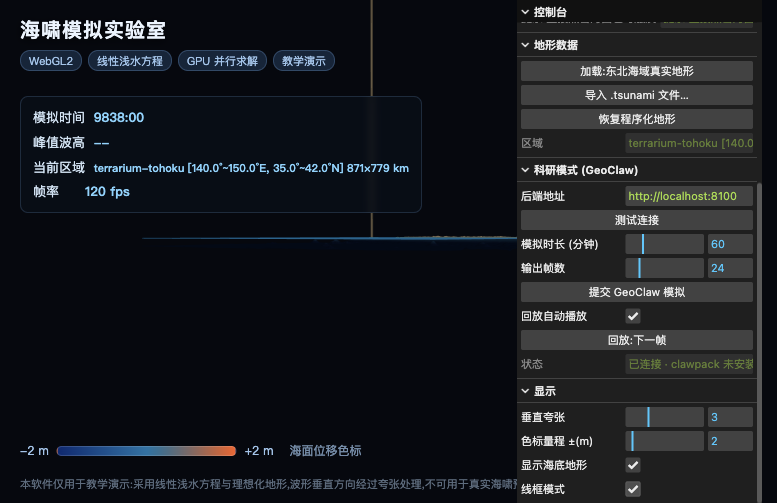

# 海啸模拟实验室(Tsunami Lab)

教学级可视化海啸模拟软件。基于**非线性浅水方程**(二阶 MUSCL-RK2 低耗散格式)在 GPU 上实时求解,
三维渲染波的传播、折射与近岸爬高过程,支持点击海面触发"海底地震"。
提供**平面区域**与 **3D 全球地球**两种视图,后者可在真实全球地形上
模拟跨洋海啸传播(波可跨越 180° 经线环绕传播)。

> 本项目定位为**教学演示**:采用理想化地形与简化非线性浅水模型(略去对流项),波形垂直方向经过夸张处理,
> 不可用于真实海啸预警或工程评估。

## 效果展示


*3D 全球地球球面模拟:等距圆柱投影 ±84°,真实地形上由东北海域 Mw9.0 震源场激发的球面海啸波纹*

| | |
|:---:|:---:|
|  |  |
| 点击触发后的隆起-沉降双极波场 | 波浪向远岸传播与折射 |
|  |  |
| 三维视角下的波面 | 线框模式查看网格形变 |

更多截图见 [`docs/screenshots/`](docs/screenshots/)。

## 运行

```bash
npm install
npm run dev      # 开发模式
npm run build    # 类型检查 + 生产构建
```

任意现代浏览器(Chrome / Edge / Safari / Firefox,macOS / Windows / Linux)打开即可使用。

## 技术选型与开源协议调研

| 组件 | 用途 | 协议 | 结论 |
|------|------|------|------|
| **Three.js** | 3D 渲染 + GPU 计算框架 | MIT | ✅ 采用。最宽松许可,可商用、可闭源分发 |
| **lil-gui** | 参数控制面板 | MIT | ✅ 采用 |
| **Vite** | 构建工具 | MIT | ✅ 采用 |
| CesiumJS | (备选)地理级三维地球 | Apache-2.0 | ⚠️ 引擎免费,但 Cesium ion 云端资产另有商业条款,暂不采用 |
| Babylon.js | (备选)3D 引擎 | Apache-2.0 | 体量偏重,教学场景不需要 |
| OpenFOAM 系 | (备选)CFD 求解 | **GPL** | ❌ 传染性协议,会波及整个项目,避免混用 |

结论:当前技术栈 **全 MIT**,无任何 copyleft 传染风险。

## 架构

```
index.html / src/main.ts        入口与 HUD 界面
src/config.ts                   全局仿真参数(网格、域尺度、时间步)
src/simulation/
  bathymetry.ts                 程序化理想海床地形(深海沟 + 海山 + 海岸)
  RealBathymetry.ts             .tsunami 二进制解析 + 经纬度域→仿真网格重采样
  shaders.ts                    全部 GLSL:求解器单步、海面/地形渲染
  TsunamiSolver.ts              GPU ping-pong 浅水方程求解器(矩形域 + 帧回放)
  cpuSolver.ts                  GPU 格式的 CPU/TS 镜像(纯函数,供 CI 无 WebGL 测试)
  benchmarks.test.ts            数值基准:衰减/收敛阶/守恒/Green/辐射反射/极地波速
  quakeSource.ts                真实断层几何 → 初始海面位移场(Okada 远场近似 +
                                多子断层非均匀滑动分布)
src/data/earthquakes.ts         历史著名海啸地震目录(USGS 近似断层参数)
src/data/observers.ts           观测点(验潮站)目录:到达时间与峰值波高统计
src/scene/SceneApp.ts           Three.js 场景:海面网格、地形、拾取、相机
src/ui/ControlPanel.ts          lil-gui 控制台
src/api/geoclawClient.ts        GeoClaw 后端 HTTP 客户端
src/api/usgsClient.ts           USGS 实时地震目录客户端(FDSN Web Service)
src/app.ts                      总装与主循环
tools/fetch_bathy.py            真实地形数据管线(GEBCO/ETOPO/瓦片 → .tsunami)
server/                         GeoClaw 科研后端(FastAPI)
data/tohoku.tsunami             随包真实地形(2011 东北海域,140–150°E 35–42°N)
data/globe.tsunami              随包全球地形(±84°,2048×1024 等距圆柱)
```

## 物理模型与数值方法

### 控制方程(非线性浅水)

以总水深 \(h = H + \eta\)(\(H\) 静水深、\(\eta\) 海面位移)表述,保留压力梯度与地形源项、
略去水平对流项 \((\mathbf{u}\cdot\nabla)\mathbf{u}\)(海啸弱非线性,教学级简化):

\[\partial_t\eta = -\nabla\cdot(h\,\mathbf{u}),\qquad \partial_t(h\,\mathbf{u}) = -g\,h\,\nabla\eta\]

- **井平衡源项**:动量通量含 \(-g\eta\nabla h\) 修正,精确抵消地形项 → \(\eta\equiv0\) 时严格静水平衡(lake-at-rest)
- **曼宁底摩擦**(隐式):\(h\mathbf{u}\leftarrow h\mathbf{u}\,/\,(1+\Delta t\,g\,n^2|\mathbf{u}|/h^{4/3})\),默认 \(n=0.025\)(面板滑杆 0–0.05)
- **干湿统一**:\(h<h_{\min}=10^{-3}\,\mathrm{m}\) 视干,界面通量置零、陆地 η 冻结(质量守恒到机器精度)
- **状态编码**:浮点纹理 RGBA —— r=η,g/b=深度积分通量 \(hu,hv\)

### 数值格式(面板「数值格式」可切换)

- **uScheme=1(默认)**:MUSCL-Hancock 重构 + minmod 限制器 + Rusanov 界面通量 + SSP-RK2 两步。
  二阶低耗散——行波 1000 步幅值衰减 <0.5%(LF 约 1.5%),网格减半误差二阶收敛
- **uScheme=0(教学对照)**:一阶 Lax–Friedrichs,最稳定但数值耗散大,保留作旧格式回退
- **时间步长自动化**:\(\Delta t = 0.5\cdot\min(\Delta x_{\text{eff}},\Delta y)/\sqrt{gH_{\max}}\)(CFL 安全因子 0.5),
  启动时按地形计算,HUD 显示实际 dt

### 边界与极地处理

- **平面域四边——辐射边界**:边界单元投影到出射特征、令入射特征为零
  (\(w^{\pm}=\eta\pm hu/c\),\(c=\sqrt{gH}\)),让出海波透射;辅以 2 单元薄海绵兜底吸收斜入射残余。
  实测反射能量 <2%(旧动量海绵约 40%)
- **全球域极地——缩减纬网**:高纬经向格距 \(\Delta x\cos\varphi\) 收缩会迫使 \(\Delta t\to0\);
  改 \(|\varphi|>74°\) 每 2 列、\(|\varphi|>80°\) 每 4 列合并(stride-k 采样),
  有效格距 \(\Delta x_{\text{eff}}=k\,\Delta x\cos\varphi\) 有限。去除旧极地 CFL 下限 hack 后,
  74° 波速误差 <3%(旧 hack 约 73% 偏慢);经向 RepeatWrapping 周期环绕,仅两极保留海绵层
- **震源**:高斯型海底瞬时抬升(点击触发);另内置**历史真实地震目录**(见下),
  按真实断层走向/倾角/滑量计算隆起-沉降双极震源

> **验证**:上述格式的 CPU/TS 镜像([`src/simulation/cpuSolver.ts`](src/simulation/cpuSolver.ts),与 GLSL 逐式同构)
> 由 [`src/simulation/benchmarks.test.ts`](src/simulation/benchmarks.test.ts) 在 CI 无 WebGL 环境下覆盖:
> 行波衰减、二阶收敛阶、静水平衡、质量守恒、Green 定律浅水放大、辐射边界反射、缩减纬网极地波速、球面长时稳定性。

### 真实地震(历史目录)

面板"真实地震(历史目录)" → 选择地震 → "触发选中的真实地震":

- 内置 7 场历史海啸地震(2011 东北、2004 苏门答腊、1960 智利、1964 阿拉斯加、
  2010 马乌莱、1700 卡斯卡迪亚假想、2018 帕卢走滑对照),断层参数取自
  USGS 震源机制解与文献近似值
- 震源由断层几何计算:倾滑分量产生沿倾向排列的"隆起 + 沉降"双极位移
  (Okada 1985 远场主导结构),滑量按矩震级经验换算;大破裂沿走向拆分为
  多个子断层,滑量按 asperity 高斯凸包非均匀分布(总矩不变);纯走滑断层
  无一级垂直位移,触发时给出说明
- 触发位置与当前域不匹配时(如平面程序化地形)会询问切换到 3D 全球视图

面板"实时地震目录 (USGS)" → 设置最小震级/时间范围 → "拉取最新地震":

- 直接从浏览器调用 USGS FDSN Event Web Service(原生支持 CORS),
  拉取近 1–30 天内全球 M6+ 地震列表,选中后一键注入模拟
- 实时目录无断层机制解,按逆冲型海啸地震经验参数自动估算断层几何
  (Wells & Coppersmith 1994 破裂尺度),面板如实标注"参数估算"

### 观测点(到达时间与峰值波高)

- 内置 10 个真实沿海观测点(宫古/希洛/克雷森特城/科迪亚克/瓦尔帕莱索/
  卡亚俄/巴东/花莲/马尼拉/陶朗加),全球模式全量显示,平面区域模式只显示
  落在区域内的站点;低分辨率下自动吸附到最近海洋单元
- 场景中以黄色锥形标记,左下 HUD 表格实时显示每站的**首次到达时间**
  (|η| ≥ 0.05 m)与**峰值波高**;触发新地震/重置时自动清零

### 地震体波可视化(P/S 波圈)

简易地震模拟:触发地震后,除了海面波场,还会叠加地震体波扩散圈
(面板"显示" → "P/S 波圈"开关):

- **P 波**(白青色)6.0 km/s,**S 波**(橙红色)3.5 km/s,环半径 =
  波速 × 发震后的模拟时间,与海啸波前(~0.2 km/s)对比可直观看到
  "地震波先到、海啸波后到"的时间差
- 球面模式按大圆弧距计算(可越过对拓点后淡出),平面模式按域 km 尺度;
  发震前 60 s 震源处有闪光提示;切换地形域后自动复位

### 3D 全球地球模式

面板"地形数据" → "加载:3D 全球地球":

- **网格**:2048×1024 等距圆柱渲染网格(赤道格距 ~19.5 km),覆盖 ±84°;
  求解网格降采样到 1024×512(~39 km)保持 GPU 步进性能;
  u=0 ↔ 180°W,v=0 ↔ 84°S,与球面 UV 天然对齐
- **球面度量**:经向格距按 cos(纬度) 收缩;极地用缩减纬网(stride-k 合并)保持有效格距有限、波速正确(见「物理模型与数值方法」)
- **经向周期**:状态纹理 RepeatWrapping,波可跨越 180° 经线连续传播;
  仅两极保留海绵层
- **震源**:点击球面任意海域触发;"预设:东北海域 Mw9.0"按真实经纬度
  (142.9°E, 38.1°N)换算 uv 注入
- **渲染**:水层/地形层双球体(半径差 0.2% 防 z-fighting),η 沿径向位移 +
  切向梯度法线,切向基在极点处加微小偏移防 NaN

### 已知简化(教学级边界)

1. 非线性浅水保留压力梯度与地形源项,但**略去水平对流项** \((\mathbf{u}\cdot\nabla)\mathbf{u}\)
   与完全非线性自由面(海啸弱非线性下影响小);近岸大波高/强对流仍需科研级 SWE(见下方 GeoClaw 模式)
2. 真实目录震源为 Okada 远场主导结构的教学级近似(含多子断层非均匀
   滑量),未含完整弹性位错核(科研模式由 GeoClaw 的 Okada 断层补齐)
3. 无科氏力、潮汐;底摩擦为曼宁公式的隐式教学级近似(不含随水深/底质变化的粗糙度场)
4. 无真实动边界 run-up 淹没(干单元以 \(h_{\min}\) 薄膜近似、陆地 η 冻结),港湾级爬高需 GeoClaw 的干湿 AMR
5. 未含频散(Boussinesq):远场长波主导场景影响小,近场短波频散需专门格式

## 真实地形数据管线

`tools/fetch_bathy.py` 把任意经纬度区域裁切、重采样为紧凑的 `.tsunami` 二进制格式
(小端:magic `TSNB` + 头部共 78 字节〔magic4 + 版本2 + 宽4 + 高4 + 四至 4×8 + 数据源名 32〕+ float32 高程),Web 端直接 fetch 加载或拖拽导入。

支持四种输入源:

```bash
python3 -m pip install numpy netCDF4 Pillow

# 1) 在线高程瓦片(无需密钥,默认;AWS elevation-tiles-prod Terrarium 编码)
python3 tools/fetch_bathy.py --tiles --west 140 --east 150 --south 35 --north 42 \
    --size 320 --name terrarium-tohoku --out data/tohoku.tsunami

# 全球模式(3D 地球用,±180°/±84°,2:1 等距圆柱;z=3 瓦片 64 张)
python3 tools/fetch_bathy.py --tiles --globe --size 2048 --name terrarium-globe --out data/globe.tsunami

# 2) GEBCO / ETOPO netCDF 离线文件(从官网下载后本地裁切)
python3 tools/fetch_bathy.py --netcdf GEBCO_2024.nc --west 140 --east 150 \
    --south 35 --north 42 --size 320 --out data/tohoku.tsunami

# 3) ESRI ASCII Grid    4) 普通灰度/高程 PNG
python3 tools/fetch_bathy.py --ascii bathy.asc --out out.tsunami
python3 tools/fetch_bathy.py --png heightmap.png --west 0 --east 1 --south 0 --north 1 --out out.tsunami
```

- 官方数据源:[GEBCO](https://www.gebco.net/data_and_products/gridded_bathymetry_data/)(15″ 全球网格)、
  [NCEI ETOPO 2022](https://www.ncei.noaa.gov/products/etopo-global-relief-model);
  若网络受限可用瓦片源替代(本仓库随包数据即由瓦片生成,高程 -9832 m ~ +6296 m)。
- Web 端:面板“地形数据” → “加载:东北海域真实地形”,或直接拖拽 `.tsunami` 文件进窗口;
  矩形域自动按等距圆柱投影换算 km 尺度,长边上限 384 格点。

## 科研模式(GeoClaw 后端)

教学级实时求解器之外,可接入 [GeoClaw](https://www.clawpack.org/geoclaw.html)
(非线性浅水方程 + AMR 自适应网格 + Okada 断层 + 曼宁底摩擦 + 干湿边界)作为高精度后端:

```bash
# 1. 安装求解器依赖(需要 Fortran 编译器)
brew install gfortran                       # Windows: 安装 MinGW-w64
python3 -m pip install clawpack             # 或 pip install -r server/requirements.txt

# 2. 启动后端服务(默认端口 8100)
python3 -m uvicorn server.app:app --port 8100
```

Web 端“科研模式 (GeoClaw)”面板:测试连接 → 设置时长/帧数 → 提交模拟
(自动把当前真实地形与“真实地震目录”选中地震的完整 Okada 断层参数
——震中/深度/破裂尺度/走向/倾角/滑动角/由矩震级与破裂面换算的滑量——
发给后端)→ 后台轮询 → 结果帧回放到三维场景。后端 API:

| 端点 | 说明 |
|------|------|
| `GET /health` | GeoClaw 环境检测(clawpack / gfortran) |
| `POST /jobs` | 提交任务(sim_time / nframes / fault / bathy_b64) |
| `GET /jobs/{id}` | 任务状态 queued/running/done/error |
| `GET /jobs/{id}/frames` | 帧索引(float32 η 场) |

后端在 clawpack 未安装时仍可启动,`/health` 如实报告环境、提交任务返回 503 安装指引(优雅降级)。

> ⚠️ **安全提示**:该后端是本地科研工具,默认 CORS 全开(`allow_origins=["*"]`),
> 无鉴权、无并发上限、无任务目录自动清理。**仅在本机或受信任内网运行,切勿直接
> 暴露公网**;若需多用户部署,请自行加反向代理鉴权、并发限制与 `_jobs/` 定期清理。

## 交互

- **点击海面**:在点击处触发地震(震级、破裂半径在右侧面板设置)
- **选择地震触发**(历史目录/实时目录/预设):屏幕中央 3 秒倒计时 →
  相机自动飞到震中 → 震源处显示红色叉号(地震学标准符号)→ 注入波场
- **拖拽 / 滚轮**:旋转与缩放视角
- **拖拽文件**:把 `.tsunami` 文件拖入窗口即可切换仿真域
- **面板**:播放/暂停、时间倍速(相对实时 1×–512×)、垂直夸张、色标量程、
  P/S 波圈开关、线框模式、地形数据加载/导入、GeoClaw 任务提交与帧回放

## 路线图

- [x] 导入真实地形(GEBCO / ETOPO / 高程瓦片 → `.tsunami` → 海床纹理)
- [x] 接入 GeoClaw 作为高精度后端(任务提交 + 结果帧回放)
- [x] 3D 全球地球模式(全球地形 + 球面求解 + 跨洋传播)
- [x] 真实地震震源(历史目录 + USGS 实时目录 + 非均匀滑量)
- [x] 观测点到达时间与峰值波高统计
- [x] 地震体波可视化(P/S 波圈)
- [x] 非线性浅水(总水深 + 井平衡源 + 曼宁摩擦)+ 二阶 MUSCL-RK2 低耗散格式
- [x] 辐射边界(特征投影)+ 缩减纬网极地处理(CPU 镜像 + 数值基准入 CI)
- [ ] 完全非线性对流项 + 真实动边界淹没(run-up 统计)
- [ ] GeoClaw 结果实时流式回放(边算边看)
- [ ] 潮位站时间序列曲线(验潮记录仪风格)
- [ ] 多语言 UI

## 许可证与数据源署名

本项目代码采用 [MIT 许可证](LICENSE)。

随包数据与外部服务的署名要求:

| 数据/服务 | 来源 | 许可/条款 |
|-----------|------|-----------|
| `data/*.tsunami` 高程数据 | AWS Open Data [Terrain Tiles](https://registry.opendata.aws/terrain-tiles/)(Terrarium 编码,基于 Mapzen/Tilezen 汇编) | 公有领域/C0 类开放数据,建议署名数据来源 |
| USGS 实时地震目录 | [FDSN Event Web Service](https://earthquake.usgs.gov/fdsnws/event/1/) | 公有领域(美国政府数据) |
| 历史地震断层参数 | USGS 震源机制解与公开文献近似值 | 公有领域/文献引用 |
| GeoClaw / Clawpack | [clawpack.org](https://www.clawpack.org/) | BSD,作为可选后端不随本仓库分发 |

地形数据仅供教学演示,精度有限,不可用于导航或灾害评估。
